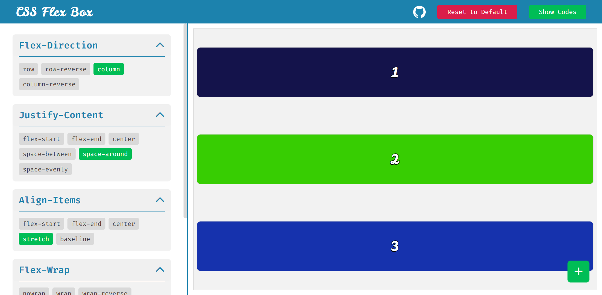
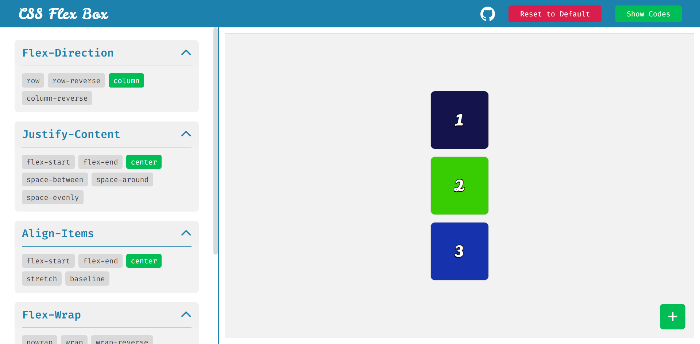
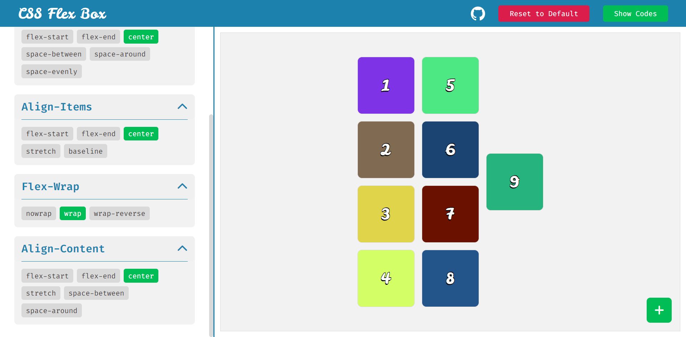
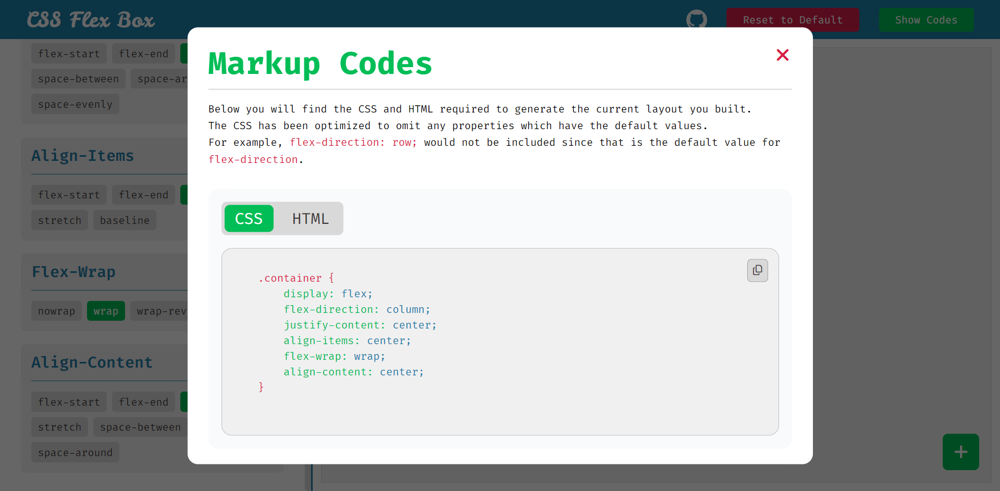
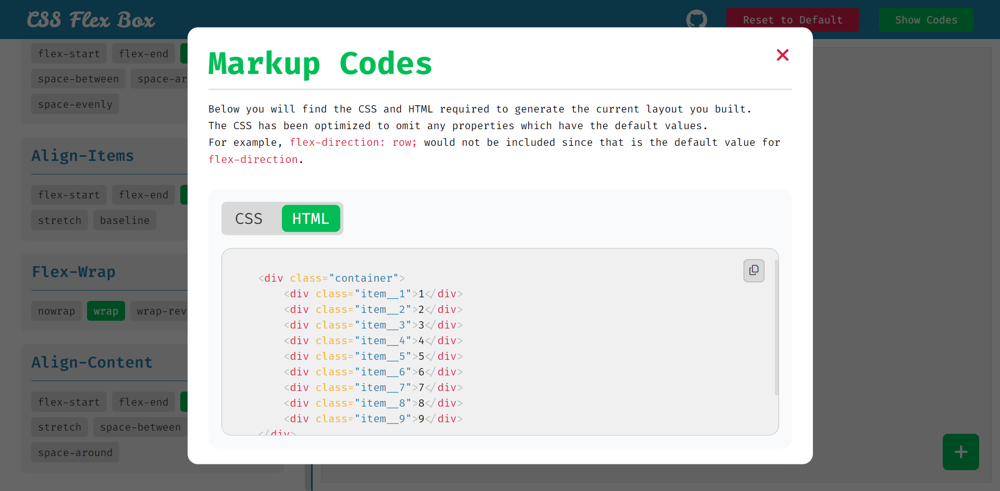
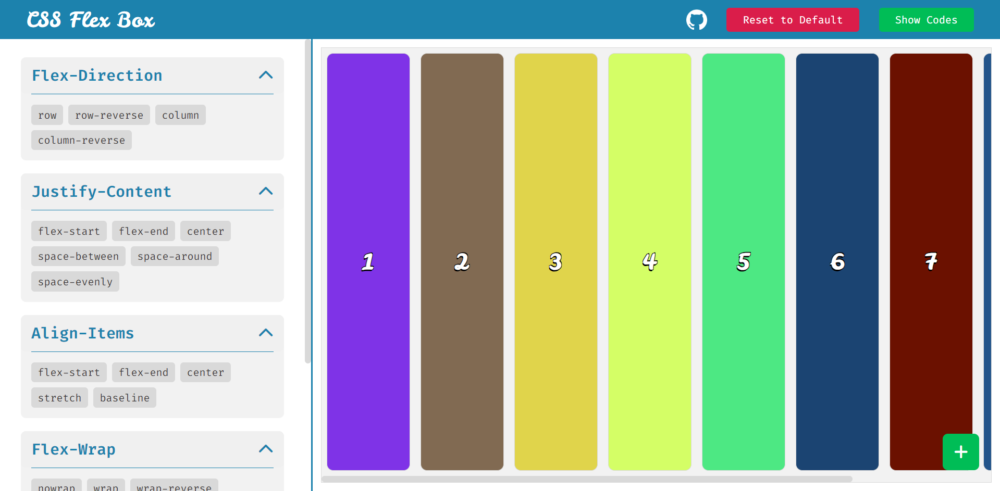
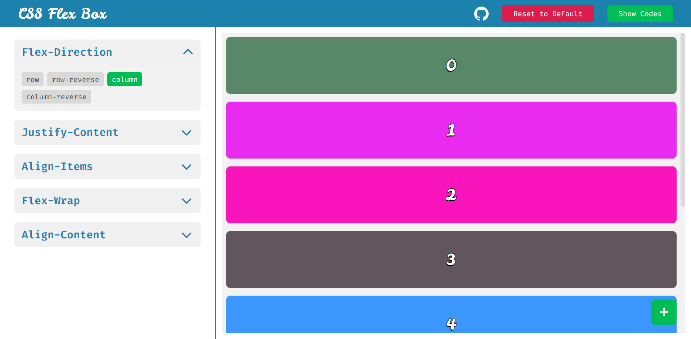

# CSS Flex Box Play Ground. 👾

Practice CSS Flex Box Layout. 😎

## [Visit - Live Site](https://nazmulhossain2905.github.io/css-flex-box/)

# Screenshots

---

---

---

---

---

---

## Using Language.

- HTML
- CSS
- JavaScript

---

### Thank You.

You can follow me. 👍🏻
